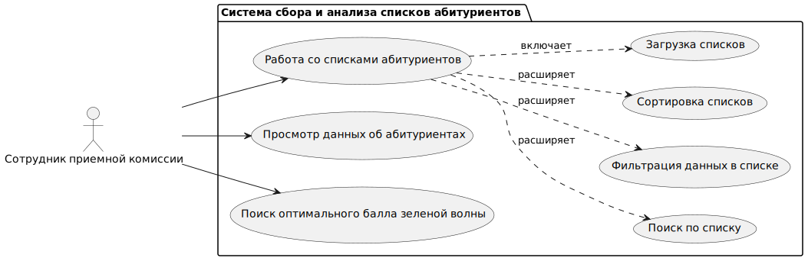
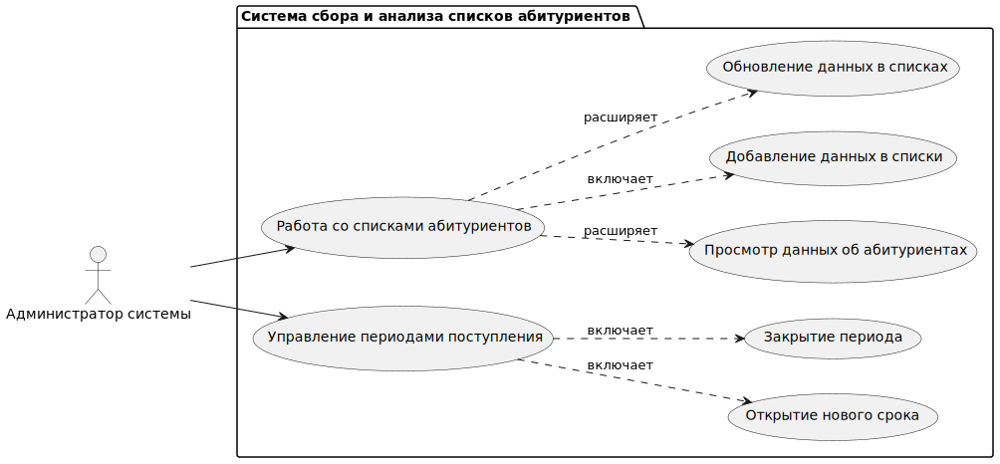

## 1. Перечень заинтересованных лиц

* Работники приемной комиссии НИУ ВШЭ
  
<ins>Описание:</ins> Прямые пользователи системы. Система поможет им упростить процесс определения балла зеленой волны, автоматизировав просмотр поданных заявлений абитуриентов и подсчет числового значения.
* НИУ ВШЭ:
  
<ins>Описание:</ins> Косвенный пользователь системы. Определение «правильного» балла зеленой волны позволит наиболее точно предсказать число реально желающих поступить в НИУ ВШЭ, что минимизирует число обучающихся за счет ВУЗа, тем самым сэкономив его бюджет. 

## 2. Перечень функциональных требований
**1. Система для типичного сотрудника приемной комиссии:**
* Возможность обновления материалов и маршрута после создания ссылки
* Возможность взаимодействия со списками абитуриентов
* Поиск информации по списку
* Фильтрация данных в списке
* Сортировка списка
* Просмотр списка
* Возможность просмотра данных об абитуриентах
* Возможность автоматического определения оптимального балла зеленой волны
  
**2. Система для администратора (сотрудник приемной комиссии с дополнительными правами):**
* Возможность взаимодействия со списками абитуриентов в системе
  1. Добавление списков
  2. Обновление списков
* Возможность управления периодами поступления
  1. Открытие новых сроков 
  2. Закрытие периода

**Сервер:**
* Реализует механизм обновления / получения данных для сотрудников в реальном времени
* Обеспечивает безопасное и эффективное хранение загруженных материалов

## 3. Диаграмма вариантов использования для функциональных требований
### Диаграмма прецедентов сотрудника приемной комиссии для функциональных требований системы

 

Код:

@startuml

left to right direction

actor "Сотрудник приемной комиссии" as act

package "Система сбора и анализа списков абитуриентов" {

  usecase UC1 as "Работа со списками абитуриентов"
  
  usecase UC2 as "Просмотр данных об абитуриентах"
  
  usecase UC3 as "Поиск по списку"
  
  usecase UC4 as "Фильтрация данных в списке"
  
  usecase UC5 as "Сортировка списков"
  
  usecase UC6 as "Просмотр списков"
  
  usecase UC7 as "Поиск оптимального балла зеленой волны"
}

act --> UC1

act --> UC2

act --> UC7

UC1 ..> UC3: расширяет

UC1 ..> UC4: расширяет

UC1 ..> UC5: расширяет

UC1 ..> UC6: включает

@enduml

### Диаграмма прецедентов для функциональных требований сотрудника приемной комиссии

 
Код:
@startuml

left to right direction

actor "Администратор системы" as act

package "Система сбора и анализа списков абитуриентов" {

  usecase UC1 as "Работа со списками абитуриентов"
  
  usecase UC2 as "Просмотр данных об абитуриентах"
  
  usecase UC3 as "Добавление данных в списки"
  
  usecase UC4 as "Обновление данных в списках"
  
  usecase UC5 as "Управление периодами поступления"
  
  usecase UC6 as "Открытие нового срока"
  
  usecase UC7 as "Закрытие периода"
}

act --> UC1

act --> UC5

UC1 ..> UC2: расширяет

UC1 ..> UC3: включает

UC1 ..> UC4: расширяет

UC5 ..> UC6: включает

UC5 ..> UC7: включает

@enduml

## 4. Перечень сделанных предположений

**1.	Пользователи:**

Предполагается, что пользователи системы имеют базовые навыки работы с компьютером и способны использовать интерфейс приложения без необходимости в дополнительном обучении.

**2.	Доступность ресурсов:**

Предполагается, что все необходимые ресурсы (например, серверы, базы данных) будут доступны и будут иметь необходимую производительность для обеспечения работы системы.

**3.	Данные:**

Предполагается, что данные, которые будут загружаться в систему, будут соответствовать единому формату (порядок столбцов в документе, наполняемые значения).

**4.	Нагрузка:**

Предполагается, что максимальное количество одновременно работающих пользователей не превысит определенного значения (например, 100 пользователей), что позволит системе функционировать без значительных задержек.

**5. Время обработки запросов пользователя:**

Предполагается, что все операции в системе (например, загрузка данных, выполнение запросов) будут завершаться в течение разумного времени (например, не более 3 секунд).

**6.	Документация:**

Предполагается, что будет предоставлена достаточная документация для пользователей и администраторов системы, чтобы они могли эффективно использовать и поддерживать систему.

## 5. Перечень нефункциональных требований

**1. Безопасность и конфиденциальность:**
  
* Данные списков абитуриентов должны быть анонимны для пользователей системы (получение расшифрованных данных должно выполняться по личным задокументированным запросам).
* Аутентификация и авторизация должны быть реализованы с использованием современных стандартов безопасности.
  
**2. Доступность:**
  
Система должна быть доступной в рабочие часы приѐмной комиссии с учѐтом временных поясов России.

**3. Удобство использования:**

Обучение использованию системы 1-го сотрудника приѐмной комиссии не должно занимать более 1-го часа. 

**4. Адаптируемость:**

В летние периоды система должна быть способна обрабатывать увеличенное число обращений.

**5. Восстанавливаемость:**

Система доолжна выполнять резервное копирование с частотой 1 сутки.
