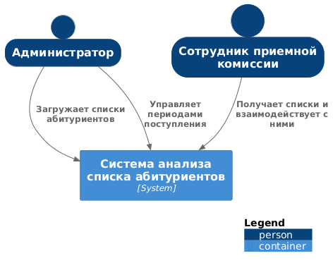
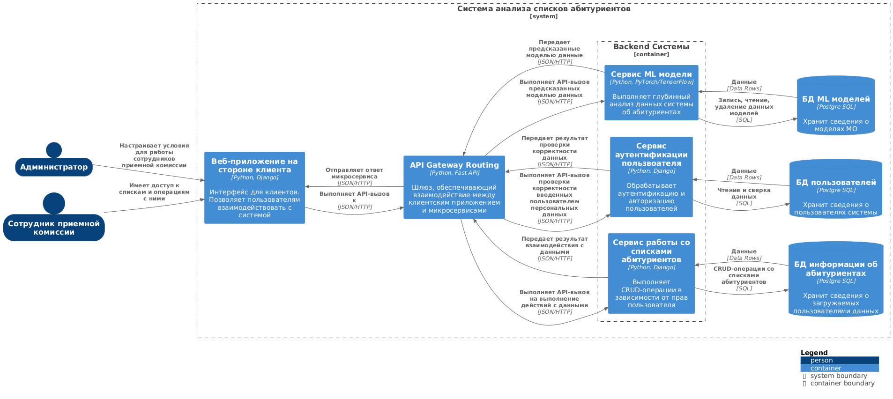

## 

## 1.	Диаграмма системного контекста

Описание взаимодействия пользователей с системой.

 

## 2. Диаграмма контейнеров

### Выбор базового архитектурного стиля:

Выбранный стиль: Микросервисная архитектура.

Преимущества:

**Надежность данных:** Обеспечение высокого уровеня достоверности и согласованности данных. Разграничение доступов к данным в зависимости от прав пользователя.

**Гибкость:** Так как данные могут меняться в зависимости от различных параметров, модель должна быть способна обрабатывать их. Для этого необходимо создавать дополнительные надстройки и вносить их в систему. Микросервисная архитектура позволяет делать это в относительно короткие сроки. 

**Доступность и отказоустойчивость:**  Автономность серверов способствует высокой работоспособности системы даже в случае отказа одного из микросервисов. В случаях высокой нагрузки в периоды поступления важно оказывать бесперебойную работу системы.

**Простота тестирования:** За счет разделения сервисов и ограниченности предметной области доступно лучшее покрытие тестами.

На уровне компонентов C4 расписана подробно серверная часть, состоящая из взаимодействующих микросервисов.

 

## 3. Диаграмма компонент

### Выбор архитектуры уровня приложений:

Выбранный паттерн: Гексагональная архитектура.

Преимущества:

**Изоляция основной бизнес-логики:** Отделение основной логики домена от внешних зависимостей позволяет сосредоточиться на реализации основной функциональности, не заботясь о специфике внешних интеграций. Такая изоляция также помогает улучшить тестируемость кода, поскольку можно тестировать основную логику независимо от внешних сервисов.

**Повышенная модульность:** Гексагональная архитектура способствует разработке модульных, композитных компонентов, что упрощает добавление новой функциональности, замену адаптеров или реорганизацию структуры приложения.

**Гибкая интеграция:** Использование портов и адаптеров позволяет легко подключать приложение к различным типам внешних сервисов и источников данных, повышая его адаптивность к различным средам и требованиям.

Каждый сервис - это автономный, независимо развертываемый программный компонент,
который реализует определенные полезные функции (доступ к которым предоставляется при помощи API). Они
реализуются адаптерами, которые взаимодействуют бизнес-логикой приложения (ядром шестигранной архитектуры). 

У бизнес-логики есть один или несколько портов. Порт определяет набор операций и то, как и в чем бизнес-логика взаимодействует внешним кодом. Существует два вида портов: входящие и исходящие. Входящий порт — это API, выставляемый наружу бизнес-логикой и доступный для вызова внешними приложениями. Исходящий порт — это то, как бизнес-логика обращается внешним системам.
Вокруг бизнес-логики размещаются адаптеры. Адаптеры также делятся на два типа: входящие и исходящие. Входящий адаптер обрабатывает запросы из внешнего мира, обращаясь входящему порту.
Исходящий адаптер реализует исходящий порт и обрабатывает запросы бизнес-логики, обращаясь внешнему приложению или сервису. 

В целом, структура сервисов описываемой системы довольна схожа. Сейчас подробно рассмотрим сервис, отвечающий за взаимодействие пользователя с данными абитуриентов.
Описываемый сервис состоит из бизнес-логики следующих адаптеров:
* адаптера REST API — входящего адаптера, который реализует REST API для
вызова бизнес-логики
* адаптера обработчика команд — входящего адаптера, который потребляет из канала
командные сообщения вызывает бизнес-логику
* адаптера базы данных — исходящего адаптера, который вызывается бизнес-логикой для доступа базе данных
* адаптера публикации доменных событий — исходящего адаптера, который осуществляет монтироинг событий.

 

* Пояснение: сервис РсСА - сервис работы со списками абитуриентов (представлен на диаграмме контейнеров).

## 4. Диаграмма компонента

