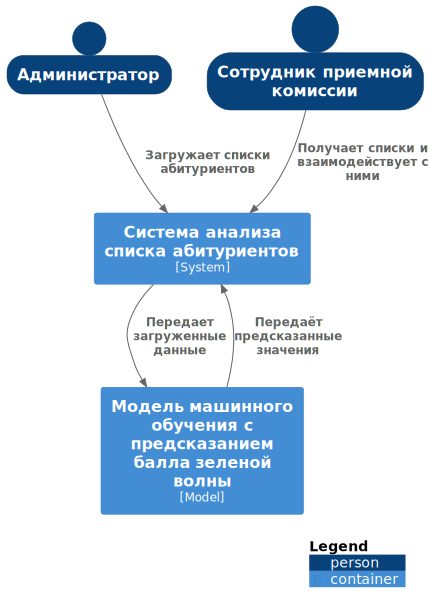

## 

## 1.	Диаграмма системного контекста

 


```plantuml
@startuml

!include https://raw.githubusercontent.com/plantuml-stdlib/C4-PlantUML/master/C4_Container.puml

' uncomment the following line and comment the first to use locally
' !include C4_Container.puml

AddElementTag("microService", $shape=EightSidedShape(), $bgColor="CornflowerBlue", $fontColor="white", $legendText="micro service\neight sided")
AddElementTag("storage", $shape=RoundedBoxShape(), $bgColor="lightSkyBlue", $fontColor="white")

SHOW_PERSON_OUTLINE()

Person(admin, Администратор)
Person(admissionsOfficer, Сотрудник приемной комиссии)
Container(c1, "Система анализа списка абитуриентов", "System")
Container(c2, "Модель машинного обучения с предсказанием балла зеленой волны", "Model")

Rel(admin, c1, "Загружает списки абитуриентов")
Rel_D(admissionsOfficer, c1, "Получает списки и взаимодействует с ними")
Rel_D(c1, c2, "Передает загруженные данные")
Rel_D(c2, c1, "Передаёт предсказанные значения")

SHOW_LEGEND()
@enduml
```

## 2. Диаграмма контейнеров

### 1. Выбор базового архитектурного стиля:

Выбранный стиль: Архитектура на основе сервисов.
Обоснование:

**Надежность данных:** Обеспечение высокого уровеня достоверности и согласованности данных. Разграничение доступов к данным в зависимости от прав пользователя.

**Гибкость:** Так как данные могут меняться в зависимости от различных параметров, модель должна быть способна обрабатывать их. Для этого необходимо создавать дополнительные надстройки и вносить их в систему. Микросервисная архитектура позволяет делать это в относительно короткие сроки. 

**Доступность и отказоустойчивость:**  Автономность серверов способствует высокой работоспособности системы даже в случае отказа одного из микросервисов. В случаях высокой нагрузки в периоды поступления важно оказывать бесперебойную работу системы.

**Простота тестирования:** За счет разделения сервисов и ограниченности предметной области доступно лучшее покрытие тестами.

## 2. Выбор архитектуры уровня приложений:
