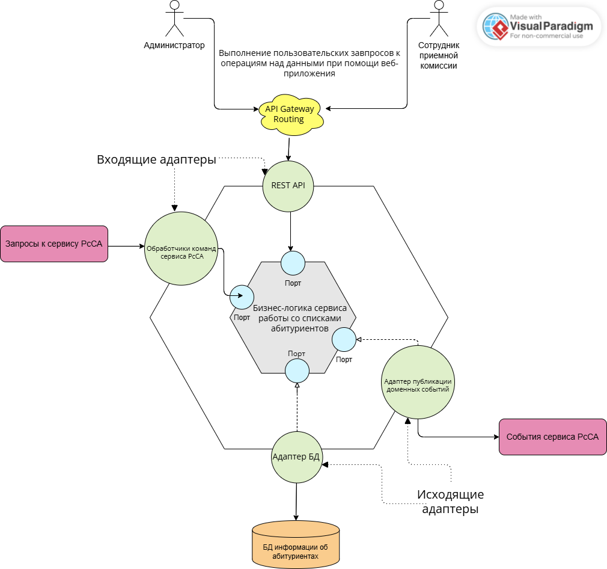

## 

## 1.	Диаграмма системного контекста

Описание взаимодействия пользователей с системой.

 


## 2. Диаграмма контейнеров

### Выбор базового архитектурного стиля:

Выбранный стиль: Микросервисная архитектура.

Преимущества:

**Надежность данных:** Обеспечение высокого уровеня достоверности и согласованности данных. Разграничение доступов к данным в зависимости от прав пользователя.

**Гибкость:** Так как данные могут меняться в зависимости от различных параметров, модель должна быть способна обрабатывать их. Для этого необходимо создавать дополнительные надстройки и вносить их в систему. Микросервисная архитектура позволяет делать это в относительно короткие сроки. 

**Доступность и отказоустойчивость:**  Автономность серверов способствует высокой работоспособности системы даже в случае отказа одного из микросервисов. В случаях высокой нагрузки в периоды поступления важно оказывать бесперебойную работу системы.

**Простота тестирования:** За счет разделения сервисов и ограниченности предметной области доступно лучшее покрытие тестами.

 


## 3. Диаграмма компонент

### Выбор архитектуры уровня приложений:

Выбранный паттерн: Гексагональная архитектура.

Преимущества:

**Изоляция основной бизнес-логики:** Отделение основной логики домена от внешних зависимостей позволяет сосредоточиться на реализации основной функциональности, не заботясь о специфике внешних интеграций. Такая изоляция также помогает улучшить тестируемость кода, поскольку можно тестировать основную логику независимо от внешних сервисов.

**Повышенная модульность:** Гексагональная архитектура способствует разработке модульных, композитных компонентов, что упрощает добавление новой функциональности, замену адаптеров или реорганизацию структуры приложения.

**Гибкая интеграция:** Использование портов и адаптеров позволяет легко подключать приложение к различным типам внешних сервисов и источников данных, повышая его адаптивность к различным средам и требованиям.

На уровне компонентов C4 расписана подробно серверна часть, состоящая из взаимодействующих микросервисов, а не одного приложения.

 

```plantuml
@startuml
!include https://raw.githubusercontent.com/plantuml-stdlib/C4-PlantUML/master/C4_Container.puml
' uncomment the following line and comment the first to use locally
' !include C4_Container.puml

LAYOUT_LEFT_RIGHT()


AddElementTag("microService", $shape=EightSidedShape(), $bgColor="CornflowerBlue", $fontColor="white", $legendText="micro service\neight sided")
AddElementTag("storage", $shape=RoundedBoxShape(), $bgColor="lightSkyBlue", $fontColor="white")

SHOW_PERSON_OUTLINE()

Person(admin, Администратор)
Person(admissionsOfficer, Сотрудник приемной комиссии)

System_Boundary(c1, "Система анализа списков абитуриентов") {
    Container(clientWeb, "Веб-приложение на стороне клиента", "Python, Django", "Интерфейс для клиентов. Позволяет пользователям взаимодействовать с системой")
    Container(api, "API Gateway Routing", "Python, Fast API", "Шлюз, обеспечивающий взаимодействие между клиентским приложением и микросервисами")

Container_Boundary(c2, "Backend Системы") {
    Container(msAuthentication,"Сервис аутентификации пользвоателя", "Python, Django", "Обрабатывает аутентификацию и авторизацию пользователей") 
    Container(msDataWork,"Сервис работы со списками абитуриентов", "Python, Django", "Выполняет CRUD-операции в зависимости от прав пользователя")    
    Container(msModel,"Сервис ML модели", "Python, PyTorch/TensorFlow", "Выполняет глубинный анализ данных системы об абитуриентах") 

}
    LAYOUT_LEFT_RIGHT()
    ContainerDb(dbUser, "БД пользователей", "Postgre SQL", "Хранит сведения о пользователях системы", $sprite="msql_server")
    ContainerDb(dbEntrantList, "БД информации об абитуриентах", "Postgre SQL", "Хранит сведения о загружаемых пользователями данных", $sprite="msql_server")
    ContainerDb(dbModel, "БД ML моделей", "Postgre SQL", "Хранит сведения о моделях МО", $sprite="msql_server")


}

Rel_D(admin, clientWeb, "Настраивает условия для работы сотрудников приемной комиссии")
Rel_D(admissionsOfficer, clientWeb, "Имеет доступ к спискам и операциям с ними")

Rel_D(api, clientWeb , "Отправляет ответ микросервиса", "JSON/HTTP")
Rel_D(clientWeb, api, "Выполняет API-вызов к", "JSON/HTTP")

Rel_D(api, msModel, "Выполняет API-вызов предсказанных моделью данных", "JSON/HTTP")
Rel_D(msModel, api, "Передает предсказанные моделью данные", "JSON/HTTP")
Rel(msModel, dbModel, "Запись, чтение, удаление данных моделей", "SQL")
Rel_U(dbModel, msModel, "Данные", "Data Rows")

Rel_D(api, msAuthentication, "Выполняет API-вызов проверки корректности введенных пользователем персональных данных", "JSON/HTTP")
Rel_D(msAuthentication, api, "Передает результат проверки корректности данных", "JSON/HTTP")
Rel_D(msAuthentication, dbUser, "Чтение и сверка данных", "SQL")
Rel_U(dbUser, msAuthentication, "Данные", "Data Rows")

Rel_D(api, msDataWork, "Выполняет API-вызов на выполнение действий с данными", "JSON/HTTP")
Rel_D(msDataWork, api, "Передает результат взаимодействия с данными", "JSON/HTTP")
Rel_D(msDataWork, dbEntrantList, "CRUD-операции со списками абитуриентов", "SQL")
Rel_U(dbEntrantList, msDataWork, "Данные", "Data Rows")

SHOW_LEGEND()
@enduml
```
## 4. Диаграмма компонента

Каждый сервис - это автономный, независимо развертываемый программный компонент,
который реализует определенные полезные функции (доступ к которым предоставляется при помощи API). Они
реализуются адаптерами, которые взаимодействуют бизнес-логикой приложения (ядром шестигранной архитектуры). 

У бизнес-логики есть один или несколько портов. Порт определяет набор операций и то, как и в чем бизнес-логика взаимодействует внешним кодом. Существует два вида портов: входящие и исходящие. Входящий порт — это API, выставляемый наружу бизнес-логикой и доступный для вызова внешними приложениями. Исходящий порт — это то, как бизнес-логика обращается внешним системам.
Вокруг бизнес-логики размещаются адаптеры. Адаптеры также делятся на два типа: входящие и исходящие. Входящий адаптер обрабатывает запросы из внешнего мира, обращаясь входящему порту.
Исходящий адаптер реализует исходящий порт и обрабатывает запросы бизнес-логики, обращаясь внешнему приложению или сервису. 

В целом, структура сервисов описываемой системы довольна схожа. Сейчас подробно рассмотрим сервис, отвечающий за взаимодействие пользователя с данными абитуриентов.
Описываемый сервис состоит из бизнес-логики следующих адаптеров:
* адаптера REST API — входящего адаптера, который реализует REST API для
вызова бизнес-логики
* адаптера обработчика команд — входящего адаптера, который потребляет из канала
командные сообщения вызывает бизнес-логику
* адаптера базы данных — исходящего адаптера, который вызывается бизнес-логикой для доступа базе данных
* адаптера публикации доменных событий — исходящего адаптера, который осуществляет монтироинг событий.

 
