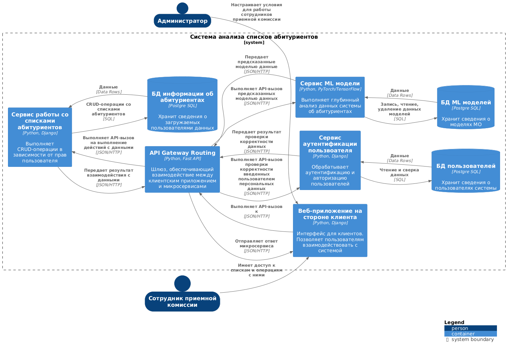
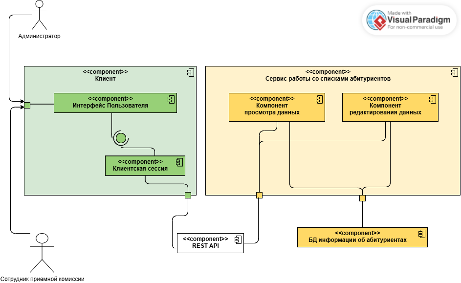

# Лабораторная работа №3

**Тема:** Использование принципов проектирования на уровне методов и классов

**Цель работы:** Получить опыт проектирования и реализации модулей с использованием принципов KISS, YAGNI, DRY, SOLID и др.

## Диаграмма контейнеров:
Для выбранного варианта использования:
Диграмма контейнеров:

 

## Диаграмма компонентов
Диграмма компонентов для сервиса работы со списками абитуриентов:

 

## Диаграмма последовательностей
<Представить диаграмму последовательностей с краткими пояснениями>

## Модель БД
<Представить модель БД в виде диаграммы классов UML с краткими пояснениями>

## Применение основных принципов разработки
<Продемонстрировать фрагменты кода, пояснив какой принцип реализуется>

## Дополнительные принципы разработки
<По каждому принципу разработки из раздела повышенной сложности обосновать отказ или применение>
