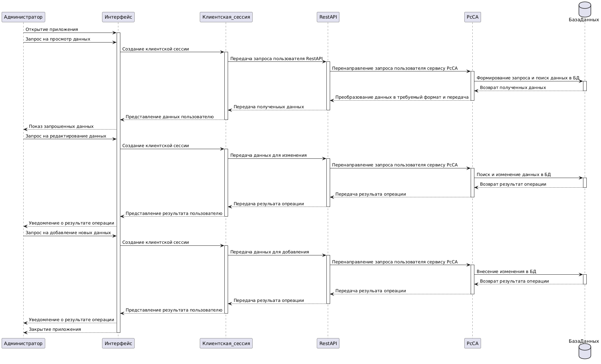

# Лабораторная работа №3

**Тема:** Использование принципов проектирования на уровне методов и классов

**Цель работы:** Получить опыт проектирования и реализации модулей с использованием принципов KISS, YAGNI, DRY, SOLID и др.

## Диаграмма контейнеров:
Для выбранного варианта использования:
Диграмма контейнеров:

 

## Диаграмма компонентов
Диграмма компонентов для сервиса работы со списками абитуриентов:

 

## Диаграмма последовательностей
Диграмма послежовательности для сервиса работы со списками абитуриентов:

 

 В диаграмме рассмотрены примеры взаимодействия администратора системы с сервисом работы со списками работы абитуриентов. Он может просмотреть данные и отредактировать их. Для этого ему необходимо завти в приложение. После выполнения входа он просматривает текущие данные об абитуриентах. Также он может отредактировать их или загрузить новые. После успешного выполнения действий он выходит из приложения. 
 
 Подробно этапы рассмотрены на диаграмме. Последующий этап и успешность его выплонения зависит от предыдущего элемента и его результата.

## Модель БД
<Представить модель БД в виде диаграммы классов UML с краткими пояснениями>

## Применение основных принципов разработки
<Продемонстрировать фрагменты кода, пояснив какой принцип реализуется>

## Дополнительные принципы разработки
<По каждому принципу разработки из раздела повышенной сложности обосновать отказ или применение>
