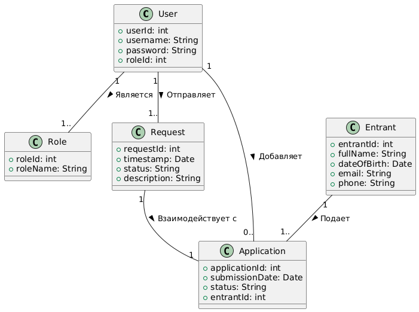

# Лабораторная работа №3

**Тема:** Использование принципов проектирования на уровне методов и классов

**Цель работы:** Получить опыт проектирования и реализации модулей с использованием принципов KISS, YAGNI, DRY, SOLID и др.

## Диаграмма контейнеров:
Для выбранного варианта использования:
Диграмма контейнеров:

 

## Диаграмма компонентов
Диграмма компонентов для сервиса работы со списками абитуриентов:

 

## Диаграмма последовательностей
Диграмма послежовательности для сервиса работы со списками абитуриентов:

 

 В диаграмме рассмотрены примеры взаимодействия администратора системы с сервисом работы со списками работы абитуриентов. Он может просмотреть данные и отредактировать их. Для этого ему необходимо завти в приложение. После выполнения входа он просматривает текущие данные об абитуриентах. Также он может отредактировать их или загрузить новые. После успешного выполнения действий он выходит из приложения. 
 
 Подробно этапы рассмотрены на диаграмме. Последующий этап и успешность его выплонения зависит от предыдущего элемента и его результата.

## Модель БД
Диграмма классов
 

Описание сущностей:
1. **User** представляет пользователей системы (Администратор и Сотрудник приемной комиссии)
2. **Role** представляет роль пользователя в системе
3. **Request** представляет запросы, отправляемые пользователями
4. **Entrant** представляет абитуриента
5. **Application** представляет заявку абитуриента

Связи:

**User (Пользователь системы)**
* может отправлять несколько запросов (Request) к БД
* может владеть несколькими Role
* может просматривать и редактировать 1 или несколько заявок (Application)

**Entrant (Абитуриент)**
 может подавать несколько заявок (Application)

 **Request (Запрос)** взаимодействует с 1 заявкой (Application)


## Применение основных принципов разработки
Серверный код:
```python
# Реализация классов согласно структуре БД
# Пользователь системы (Администратор / сотрудник приемной комиссии)
class User(db.Model):
    userId = db.Column(db.Integer, primary_key=True)
    username = db.Column(db.String(80), unique=True, nullable=False)
    password = db.Column(db.String(120), nullable=False)
    roleId = db.Column(db.Integer, db.ForeignKey('role.roleId'))

# Роль сотрудника - пользователя в системе
class Role(db.Model):
    roleId = db.Column(db.Integer, primary_key=True)
    roleName = db.Column(db.String(80), nullable=False)

# Просмотр всех пользователей пользователей системы
@app.route('/users', methods=['GET'])
def get_users():
    users = User.query.all()
    return jsonify([{'userId': user.userId, 'username': user.username} for user in users])

# Просмотр всех поданных заявок
@app.route('/applications', methods=['POST'])
def add_application():
    data = request.get_json()
    new_application = Application(
        submissionDate=data['submissionDate'],
        status=data['status'],
        entrantId=data['entrantId']
    )
    db.session.add(new_application)
    db.session.commit()
    return jsonify({'applicationId': new_application.applicationId}), 201
```


Клиентский код:
```python
def get_users():
    response = requests.get(f'{BASE_URL}/users')
    return response.json()

# Добавление новой заявки
def add_application(submission_date, status, entrant_id):
    application_data = {
        'submissionDate': submission_date,
        'status': status,
        'entrantId': entrant_id
    }
    response = requests.post(f'{BASE_URL}/applications', json=application_data)
    return response.json()
```


## Дополнительные принципы разработки
<По каждому принципу разработки из раздела повышенной сложности обосновать отказ или применение>
