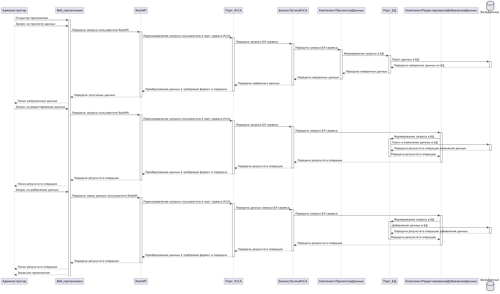

# Лабораторная работа №3

**Тема:** Использование принципов проектирования на уровне методов и классов

**Цель работы:** Получить опыт проектирования и реализации модулей с использованием принципов KISS, YAGNI, DRY, SOLID и др.

## Диаграмма контейнеров:
Для выбранного варианта использования:
Диграмма контейнеров:

 

## Диаграмма компонентов
Диграмма компонентов для сервиса работы со списками абитуриентов:

 

## Диаграмма последовательностей
Диграмма послежовательности для сервиса работы со списками абитуриентов:

 

 В диаграмме рассмотрены примеры взаимодействия администратора системы с сервисом работы со списками работы абитуриентов. Он может просмотреть данные и отредактировать их. Для этого ему необходимо завти в приложение. После выполнения входа он просматривает текущие данные об абитуриентах. Также он может отредактировать их или загрузить новые. После успешного выполнения действий он выходит из приложения. 
 
 Подробно этапы рассмотрены на диаграмме. Последующий этап и успешность его выплонения зависит от предыдущего элемента и его результата.

## Модель БД
Диграмма классов
 

Описание сущностей:
1. **User** представляет пользователей системы (Администратор и Сотрудник приемной комиссии)
2. **Role** представляет роль пользователя в системе
3. **Request** представляет запросы, отправляемые пользователями
4. **Entrant** представляет абитуриента
5. **Application** представляет заявку абитуриента

Связи:

**User (Пользователь системы)**
* может отправлять несколько запросов (Request) к БД
* может владеть несколькими Role
* может просматривать и редактировать 1 или несколько заявок (Application)

**Entrant (Абитуриент)**
 может подавать несколько заявок (Application)

 **Request (Запрос)** взаимодействует с 1 заявкой (Application)


## Применение основных принципов разработки
Серверный код:
```python
# Реализация классов согласно структуре БД
# Пользователь системы (Администратор / сотрудник приемной комиссии)
class User(db.Model):
    userId = db.Column(db.Integer, primary_key=True)
    username = db.Column(db.String(80), unique=True, nullable=False)
    password = db.Column(db.String(120), nullable=False)
    roleId = db.Column(db.Integer, db.ForeignKey('role.roleId'))

# Роль сотрудника - пользователя в системе
class Role(db.Model):
    roleId = db.Column(db.Integer, primary_key=True)
    roleName = db.Column(db.String(80), nullable=False)

# Просмотр всех пользователей пользователей системы
@app.route('/users', methods=['GET'])
def get_users():
    users = User.query.all()
    return jsonify([{'userId': user.userId, 'username': user.username} for user in users])

# Просмотр всех поданных заявок
@app.route('/applications', methods=['POST'])
def add_application():
    data = request.get_json()
    new_application = Application(
        submissionDate=data['submissionDate'],
        status=data['status'],
        entrantId=data['entrantId']
    )
    db.session.add(new_application)
    db.session.commit()
    return jsonify({'applicationId': new_application.applicationId}), 201
```


Клиентский код:
```python
def get_users():
    response = requests.get(f'{BASE_URL}/users')
    return response.json()

# Добавление новой заявки
def add_application(submission_date, status, entrant_id):
    application_data = {
        'submissionDate': submission_date,
        'status': status,
        'entrantId': entrant_id
    }
    response = requests.post(f'{BASE_URL}/applications', json=application_data)
    return response.json()
```
### Объяснение принципов
#### KISS (Keep It Simple, Stupid)
Код написан просто и понятно. Используются базовые операции CRUD без излишней сложности. API имеет простые маршруты для получения пользователей и добавления заявок, что делает его легким для понимания.

#### YAGNI (You Aren't Gonna Need It): 
Код не содержит ненужных функций или сложных структур. Он реализует только те функции, которые необходимы в данный момент, без добавления избыточного функционала.

#### DRY (Don't Repeat Yourself):
В серверном коде не повторяются определения моделей и маршрутов. Все повторяющиеся действия (например, добавление в базу данных) обрабатываются с помощью функций, что уменьшает дублирование кода.

#### SOLID:

**S (Single Responsibility Principle):** Каждый класс (модель) отвечает только за свои данные. Например, класс User  отвечает только за пользователей.

**O (Open/Closed Principle):** Код открыт для расширения (например, можно легко добавить новые маршруты или модели), но закрыт для модификации (существующий код не нужно менять для добавления нового функционала).

**L (Liskov Substitution Principle):** Все модели могут быть заменены другими, если они соответствуют интерфейсу (например, можно создать дополнительные модели для других типов заявок).

**I (Interface Segregation Principle):** В данном случае не требуется интерфейсов, так как код достаточно прост.

**D (Dependency Inversion Principle):** Используется зависимость от абстракций (например, SQLAlchemy), что позволяет легко менять реализацию хранения данных.


## Дополнительные принципы разработки
### BDUF - Big design up front (Глобальное проектирование прежде всего)

**Преимущества:**

* Позволяет заранее выявить потенциальные проблемы и риски
* Обеспечивает четкое понимание требований и архитектуры системы для всех участников проекта
* Упрощает планирование и распределение задач

**Недостатки:**

* Может привести к чрезмерной документации и замедлению процесса разработки
* Риски изменения требований в процессе разработки могут сделать предварительное проектирование устаревшим

**Итог:** BDUF может быть применим в текущем проекте, так как требования определяются заранее и не сильно подвержены изменениям

### SoC - Separation оf concerns (Принцип разделения ответственности)
Принцип разделения ответственности подразумевает разделение системы на отдельные части (или модули), каждая из которых отвечает за свою функциональность. Это упрощает понимание, разработку и поддержку системы.

**Преимущества:**

* Упрощает тестирование, отладку и поддержку, поскольку изменения в одной части системы не влияют на другие
* Позволяет параллельно работать над различными модулями

**Недостатки:**

* Может привести к усложнению архитектуры в простых проектах
* Необходимость в четком определении интерфейсов между модулями

**Итог:** SoC используется за счет реализации микросервисной архитектуры

### MVP - Minimum viable product (Минимально жизнеспособный продукт)
Концепция создания минимально жизнеспособного продукта, обладающего достаточным набором функций, чтобы удовлетворить потребности ранних пользователей и собрать обратную связь для дальнейшего развития.

**Преимущества:**

* Позволяет быстро выйти на рынок и протестировать идеи с минимальными затратами
* Сбор обратной связи от пользователей помогает определить, какие функции имеют наибольшее значение

**Недостатки:**

* Может привести к созданию продукта низкого качества
* Не всегда легко определить, какие функции являются "минимально жизнеспособными"

**Итог:** Можно использовать в текущем проекте, так как сроки сжаты


### PoC - Proof of concept (Доказательство концепции)
Концепция создания небольшого проекта или прототипа, который демонстрирует жизнеспособность идеи или технологии. Он используется для проверки идей перед их полным внедрением.

**Преимущества:**

* Позволяет проверить технические аспекты и жизнеспособность идеи на ранних стадиях
* Уменьшает риски, связанные с инвестициями в полное решение, если концепция не сработает

**Недостатки:**
* Может потребовать значительных ресурсов для создания, несмотря на свою небольшую масштабируемость
* Не всегда отражает реальные условия использования, что может привести к ошибочным выводам

**Итог:** В текущем проекте может быть ненужной тратой ресурсов, так как время на выполнение и пересмотр ограничено
